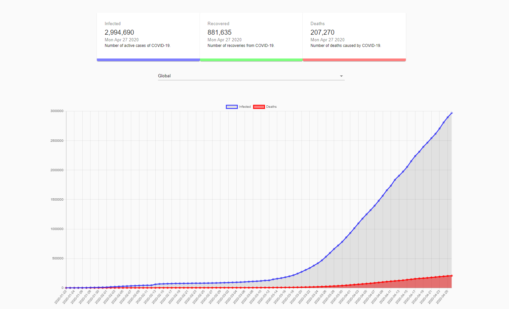

<h1 align="center">
    
</h1>

    <a href="#rocket-Technologies">Technologies</a>&nbsp;&nbsp;&nbsp;|&nbsp;&nbsp;&nbsp;
    <a href="#-Layout">Layout</a>&nbsp;&nbsp;&nbsp;|&nbsp;&nbsp;&nbsp;
    <a href="#-API">API</a>&nbsp;&nbsp;&nbsp;|&nbsp;&nbsp;&nbsp;

 

## :rocket: Technologies

This project was developed with the following technologies:

- [React](https://reactjs.org) 
- [Chartjs](https://www.chartjs.org/) 
- [Material-ui](https://material-ui.com/)

## 💻  Layout

<h1 align="center">
    
</h1>

## 💻  API

 [API](https://covid19.mathdro.id/api)

---

Made with Isaque Igor :wave: [Get in touch!](https://www.linkedin.com/in/isaqueigor/)
